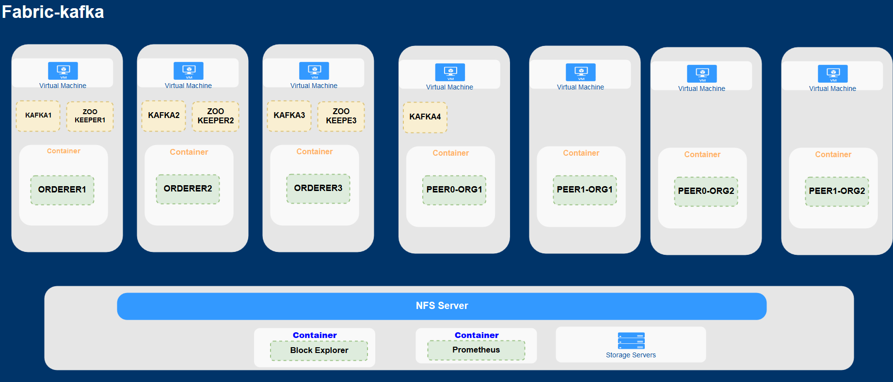
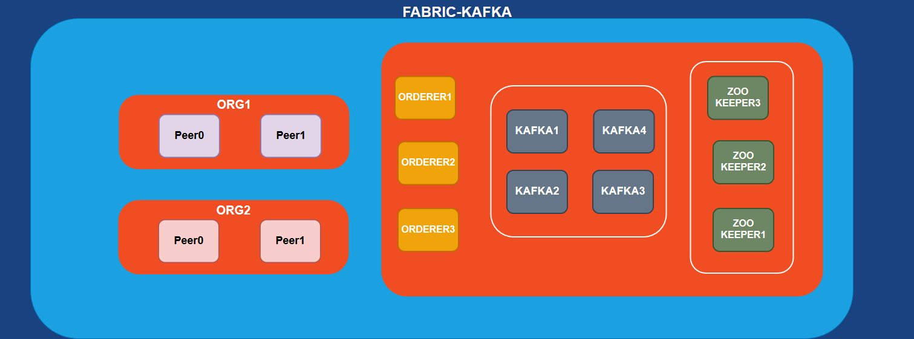
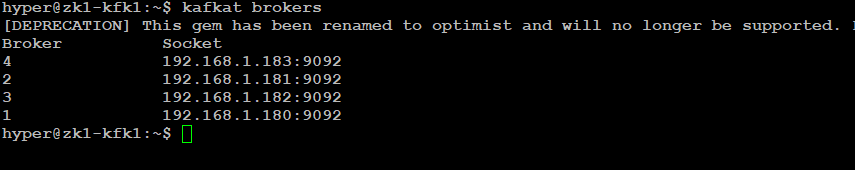
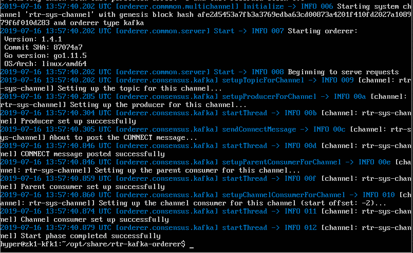
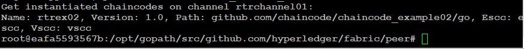
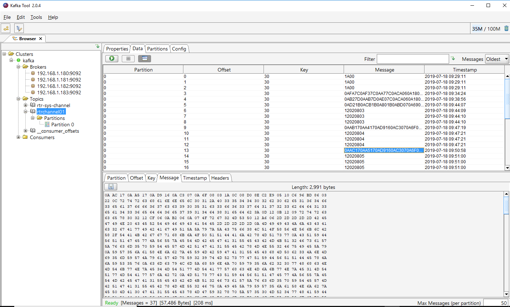
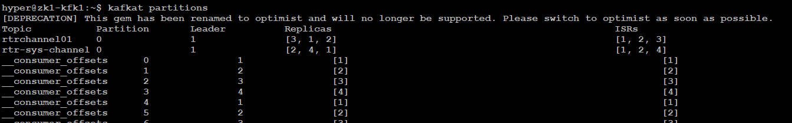
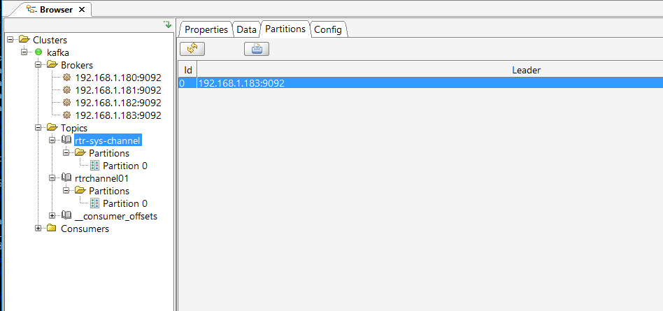
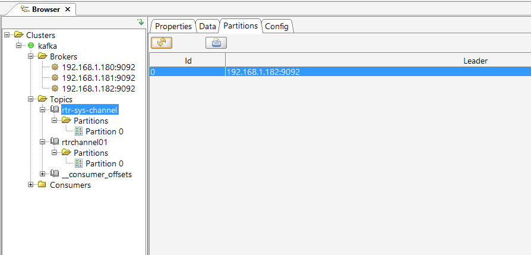
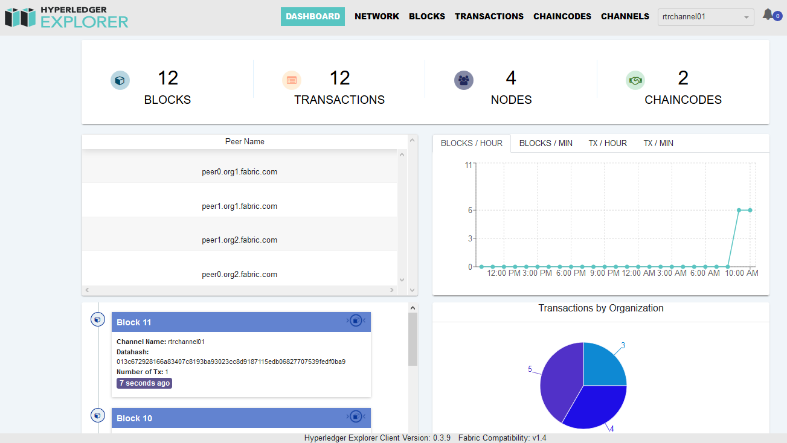

# Hyperledger Fabric With kafka ordering service.


This article will illustrate how to configure hyperledger fabric with *Kafka*-based ordering service.

In this deployment We will configure Multi Node Apache Kafka/Zookeeper Cluster with 3 zookeeper nodes and 4 kafka nodes. After deployment we will use kafka related commands and Gui tools to verify the cluster has created the topics as per the fabric model we configured. We will verify the leader election process as well.



​																							*Network Topology*

We will be deploying the Hyperledger Fabric network consisting of two organization, maintaining two peers each, there orderers with ‘**kafka**’ ordering service. We will create a channel , join peers to the channel , install chaincode on peer and instantiate chaincode on channel. Also invoke transactions against the deployed chaincode.



​																			*Fabric Deployment Model*


For this deployment will be using multiple Virtual hosts. We will be deploy multi node kafka/zookeepr cluster on virtual hosts and docker containers for ordereres and peers. We will use Nfs server for accessing network artifacts across the hosts .In the end we will also deploy Hyperledger Block explorer .Refer above for the Network topology this article follows .

**Server Configurations**

- [Configure ](https://help.ubuntu.com/lts/serverguide/network-file-system.html)your NFS file server VM and mount the NFS share on all the nodes by adding entries to /etc/fstab.
- [Configure](https://www.desgehtfei.net/basic-setup-of-a-multi-node-apache-kafka-zookeeper-cluster/) 3 zookeeper nodes and 4 Kafka nodes follow the reference link. 

- In the kafka/config directory these are the two config files of interest. server.properties , zookeeper.properties


- Make the following changes in the server.properties file for each node:

- 
  The value of the ***broker.id*** property should be changed such that it is unique throughout the cluster. 

- The value of the ***zookeeper.connect*** property should be changed such that all nodes point to the same ZooKeeper instance. This property specifies the Zookeeper instance's address and follows the HOSTNAME01/IP_ADDRESS01:2181, HOSTNAME02/IP_ADDRESS02:2181 ,format. 


- Make sure to add the below setting to *server.properties* as per the [Fabric documentation](https://hyperledger-fabric.readthedocs.io/en/latest/kafka.html#steps)

```bash
############################# Additional Orderer Settings #############################
unclean.leader.election.enable=false
min.insync.replicas=2
default.replication.factor=3
replica.fetch.max.bytes=103809024 
message.max.bytes=103809024
#The value 103809024=99 * 1024 * 1024B Based on Orderer.AbsoluteMaxBytes in configtx.yaml
```

- Make the following changes in the *zookeeper.properties* file for each node

```bash
clientPort=2181
clientPortAddress=HOSTNAME01/IP_ADDRESS01
# zoo servers
  server.1=HOSTNAME01/IP_ADDRESS01:2888:3888
  server.2=HOSTNAME02/IP_ADDRESS02:2888:3888
  server.3=HOSTNAME03/IP_ADDRESS02:2888:3888
```

Start Zookeeper Nodes and then Kafka Nodes

```bahs
kafka/bin/zookeeper-server-start.sh -daemon kafka/config/zookeeper.properties
kafka/bin/kafka-server-start.sh -daemon kafka/config/server.properties

```

**Verify Brokers are up.**

Install **kafkat** on one of the nodes .It is a simplified command-line administration for Kafka brokers refer the [git repo](https://github.com/airbnb/kafkat) for instructions.

Run command **kafkat brokers**  to verify all brokers are up.




#### **Generate the Network Artifacts**

Generate the network artifacts using crypto-config.yaml ,[configtx.yaml](fabric-kafka/configtx.yaml) .Verify the configtx.yaml has set the properties  **OrdererType: kafka** and has listed all the kafka brokers.

If you intent to modify the network topology, change the configuration files (.yaml files) appropriately.

```bash
bin/cryptogen generate --config=./crypto-config.yaml

bin/configtxgen -profile TwoOrgsOrdererGenesis -channelID rtr-sys-channel -outputBlock ./channel-artifacts/genesis.block

export CHANNEL_NAME=rtrchannel01
bin/configtxgen -profile TwoOrgsChannel -outputCreateChannelTx ./channel-artifacts/channel.tx -channelID $CHANNEL_NAME

bin/configtxgen -profile TwoOrgsChannel -outputAnchorPeersUpdate ./channel-artifacts/Org1MSPanchors.tx -channelID $CHANNEL_NAME -asOrg Org1MSP

bin/configtxgen -profile TwoOrgsChannel -outputAnchorPeersUpdate ./channel-artifacts/Org2MSPanchors.tx -channelID $CHANNEL_NAME -asOrg Org2MSP

```

**NFS Share**

Copy (or use bind) the files from network artifacts , crypto and chaincode directory and *.yaml files to NFS share.(we will be sharing (use bind) fabric-kafka directory in this demonstration)

- **Start the network**

  Now lets start the network by running docker scripts from the Nfs share directory on the respective hosts.

  ```bash
  cd opt/share/fabric-kafka
  
  VM1- docker-compose -f docker-compose-orderer1.yaml up -d
  VM2- docker-compose -f docker-compose-orderer2.yaml up -d
  VM3- docker-compose -f docker-compose-orderer3.yaml up -d
  
  VM4- docker-compose -f docker-compose-peer0-org1.yaml up -d
  VM5- docker-compose -f docker-compose-peer1-org1.yaml up -d
  
  VM6- docker-compose -f docker-compose-peer0-org2.yaml up -d
  VM7- docker-compose -f docker-compose-peer1-org2.yaml up -d
  ```

  

  Orderer logs at this point would show *orderer.consensus.kafka* related logs of Topic creation, setup of producers and consumers for the system channel specified during config.

  

  ​																			*Orderer logs*

  #### **Create channel and join the peers**
  
  ```bash
  #VM4
  docker exec -it cli bash
  # Create channel
  export CHANNEL_NAME=rtrchannel01
  peer channel create -o orderer1.fabric.com:7050 -c $CHANNEL_NAME -f ./channel-artifacts/channel.tx --outputBlock ./channel-artifacts/rtrchannel01.block --tls --cafile /opt/gopath/src/github.com/hyperledger/fabric/peer/crypto/ordererOrganizations/fabric.com/orderers/orderer1.fabric.com/msp/tlscacerts/tlsca.fabric.com-cert.pem
  peer channel join -b ./channel-artifacts/rtrchannel01.block
  
  # Join channel on each peer
  peer channel fetch newest -o orderer1.fabric.com:7050 -c $CHANNEL_NAME
  peer channel join -b $CHANNEL_NAME_newest.block
  
  # Channel update
  peer channel update -o orderer1.fabric.com:7050 -c $CHANNEL_NAME -f ./channel-artifacts/Org1MSPanchors.tx --tls --cafile /opt/gopath/src/github.com/hyperledger/fabric/peer/crypto/ordererOrganizations/fabric.com/orderers/orderer1.fabric.com/msp/tlscacerts/tlsca.fabric.com-cert.pem
  
  peer channel update -o orderer1.fabric.com:7050 -c $CHANNEL_NAME -f ./channel-artifacts/Org2MSPanchors.tx --tls --cafile /opt/gopath/src/github.com/hyperledger/fabric/peer/crypto/ordererOrganizations/fabric.com/orderers/orderer1.fabric.com/msp/tlscacerts/tlsca.fabric.com-cert.pem

  ```

  **Install , instantiate , Invoke Chain Code**
  
  ```bash
  export CHANNEL_NAME=rtrchannel01
  #Install on all peers
  peer chaincode install -n rtrex02 -v 1.0 -p github.com/chaincode/chaincode_example02/go
  peer chaincode list --installed
  
  #Instantiate on peer0.org1.fabric.com or any other of choice
  peer chaincode instantiate -o orderer1.fabric.com:7050 -C $CHANNEL_NAME -n rtrex02 -v 1.0 -c '{"Args":["init","a","100","b","200"]}' --tls --cafile /opt/gopath/src/github.com/hyperledger/fabric/peer/crypto/ordererOrganizations/fabric.com/orderers/orderer1.fabric.com/msp/tlscacerts/tlsca.fabric.com-cert.pem -P "OR ('Org1MSP.peer','Org2MSP.peer')"
  peer chaincode list --instantiated -C $CHANNEL_NAME 
  
  #Invoke on peer0.org1.fabric.com
  peer chaincode invoke -o orderer1.fabric.com:7050 -C $CHANNEL_NAME -n rtrex02 -c '{"Args":["invoke","a","b","10"]}' --tls --cafile /opt/gopath/src/github.com/hyperledger/fabric/peer/crypto/ordererOrganizations/fabric.com/orderers/orderer1.fabric.com/msp/tlscacerts/tlsca.fabric.com-cert.pem 60s
  
  peer chaincode query -C $CHANNEL_NAME -n rtrex02 -c '{"Args":["query","a"]}' 
  ```


  

  ​																*Chaincode Instantiated*

####   **kafka brokers and Topics**

  - Lets verify our kafka cluster using [**kafka tool**](http://www.kafkatool.com) (free for non commercial use). Provide your zookeeper node’s hostname/ip ,port ,a name for your cluster and connect.
  - *We can see the list of brokers , Topics , partitions .The Topics are created with the system channel name and the channel name we configured .Select topics to verify the leader* .


We can see the list of brokers , Topics , partitions .The Topics are the system channel and the channel we created and selecting channel shows the leader broker id =0.



​																					*Partition data tab* 

*Partition data tab shows messages and their keys in the partitions of channel topics. For chaincode invoke transaction we can see messages being produced under topic channel name.*

**Kafkat** :- You can also use kafkat commands to see information in CLI .

****

```bash
# kafkat commands
kafkat brokers
kafkat partitions # Shows Topics ,Partition , Leader , Replicas
kafkat topics
```

You can also run the 'kafkat partitions' command to the see the results below which shows topics which are channels leader,replicas. 




#### **Kafka verify leader election.**

 Before :- Number of Brokers =4 ,Current Leader IP 183




```bash
# Lets stop the leader run this command on leader node  
kafka/bin/kafka-server-stop.sh
```


After :- Number of Brokers =3 ,New Leader IP 182




### [Hyperledger Block Explorer](https://github.com/hyperledger/blockchain-explorer)

Follow this [article](https://medium.com/beyondi/understanding-hyperledger-explorer-setup-via-docker-6af845fcb82e) to setup the block explorer.

Setup and Start the explorer. The dashboard has very useful information we can use to verify our deployment and transactions.



​																		*Block Explorer Dashboard*


References

https://medium.com/beyondi/understanding-hyperledger-explorer-setup-via-docker-6af845fcb82e

http://www.kafkatool.com/features.html

https://www.digitalocean.com/community/tutorials/how-to-install-apache-kafka-on-centos-7

https://hyperledger-fabric.readthedocs.io/en/latest/kafka.html#steps
